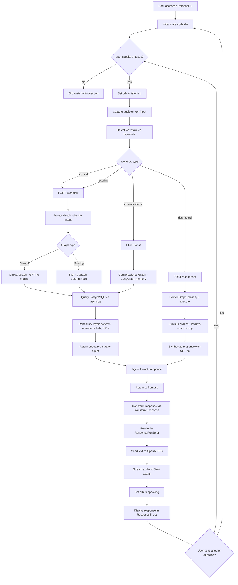

# Personal AI

                     

AI-powered hospital management platform. Replaces 14 n8n workflows with Python agents (LangChain/LangGraph + GPT-4o) and a modern React frontend with voice interaction and digital avatar.

## Repositories

```
personal-ai-backend/   → Python API (FastAPI + LangChain/LangGraph + PostgreSQL)
personal-ai-frontend/  → React SPA (TanStack Start + Tailwind v4)
```

## Documentation

| File | Description |
|------|-------------|
| `personal-ai-backend/README.md` | Backend setup, endpoints, and workflows |
| `personal-ai-frontend/README.md` | Frontend setup, components, and scripts |
| `ARCHITECTURE.md` | Unified architecture, flow, deployment, migration docs |
| `personal-ai-backend/N8N_VS_PYTHON.md` | n8n vs Python + LangChain/LangGraph comparison |

## System Flow



> **SVG export:** Copy the Mermaid block above to [mermaid.live](https://mermaid.live) or use the CLI: `mmdc -i README.md -o architecture.svg -t dark -b transparent`

## Quick Start
cd personal-ai-backend
echo "OPENAI_API_KEY=sk-..." > .env
docker compose up -d

# Backend:  http://localhost:8000
# Frontend: http://localhost:3000
# Swagger:  http://localhost:8000/docs
```
